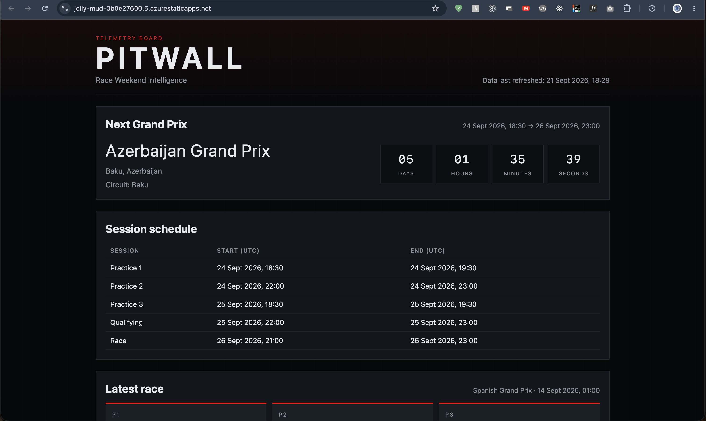

# PitWall — F1 Race & Season Intelligence

Live: [https://jolly-mud-0b0e27600.5.azurestaticapps.net](https://jolly-mud-0b0e27600.5.azurestaticapps.net)

PitWall is a serverless Formula 1 dashboard on Azure, backed by historical OpenF1 data. The browser never calls OpenF1. Visitors read a Function API that serves a private Blob cache.

**[Documentation](./docs/README.md)** — architecture, API, reliability, security, and local setup.

Unofficial fan project. Not affiliated with Formula 1, FIA, or Formula One Management. Data provided by OpenF1.
