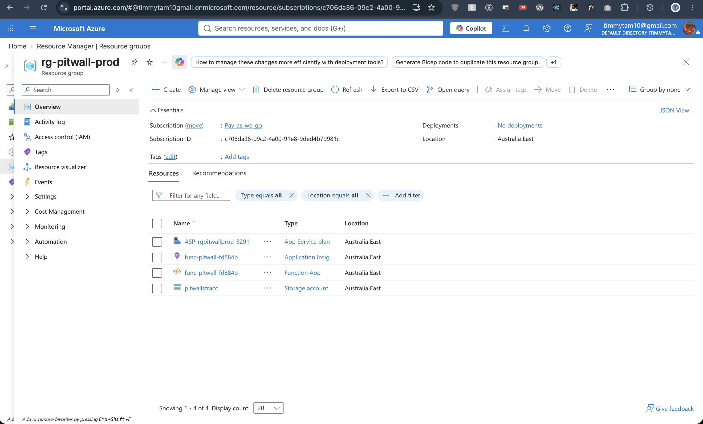
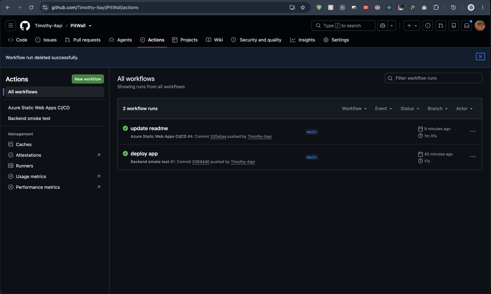

# Architecture

PitWall is a serverless read path in front of OpenF1. Visitors never call OpenF1. They read a Function API that serves JSON from a private Blob container.

```text
OpenF1
   │
   ├── Timer Function ──→ dashboard.json ─┐
   │                                      │
   └── Race-detail cache miss             │
             ↓                            │
        HTTP Function                     │
             ↓                            │
     races/<sessionKey>.json              │
             ↓                            │
         Blob Storage ←───────────────────┘
             ↓
        Function API
             ↓
   Azure Static Web App
```

Application Insights is attached to the Function App.



## Why the browser does not call OpenF1

A public page that `fetch`es OpenF1 directly would:

- burn the free-tier request budget on every page view
- couple the UI to an upstream schema that is still marked beta in places
- give every visitor a live dependency with no last-known-good cache
- make CORS, retries, and rate-limit pacing a frontend problem

PitWall normalizes OpenF1 once, writes the result to Blob Storage, and serves that snapshot.

## Two caches, two cadences

| Blob | Writer | Reader | Cadence |
| --- | --- | --- | --- |
| `dashboard.json` | Timer `refreshOpenF1` (and key-protected `POST /api/refresh`) | `GET /api/dashboard` | Scheduled. Every 6 hours at minute 15 (`0 15 */6 * * *`). |
| `races/<sessionKey>.json` | `GET /api/race/{sessionKey}` on cache miss | Same HTTP function | Cache-aside. Built only when a visitor opens a race. |

The dashboard snapshot is deliberately small: next meeting, podium, standings, and a list of completed races. Lap, stint, pit, overtake, and race-control datasets stay out of the scheduled refresh.

```text
select race
    ↓
/api/race/<sessionKey>
    ↓
Blob cache?
  ↙       ↘
yes       no
 ↓         ↓
return   OpenF1
           ↓
       normalize
           ↓
         cache
           ↓
         return
```


## Static Web App and Function App are separate

Azure Static Web Apps managed functions support HTTP triggers only. PitWall needs a timer trigger, so the Function App is a standalone resource.

The frontend therefore calls the Function App hostname directly (`https://func-pitwall-fd884b.azurewebsites.net` in production). CORS on that Function App is restricted to the Static Web App origin.

A Static Web Apps bring-your-own-backend link would require the SWA Standard plan. The Free SKU plus an explicit Function origin is the cheaper, clearer split for this application.

## Request pacing

`api/src/lib/openf1.js` serializes upstream calls with a 400 ms minimum interval (override with `OPENF1_MIN_INTERVAL_MS`) and retries HTTP 429 twice with backoff. That is the free-tier budget, not a guess.

## Source map

- `api/src/lib/openf1.js` — paced OpenF1 client
- `api/src/lib/buildDashboard.js` — current-season snapshot
- `api/src/lib/buildRace.js` — normalized race analysis
- `api/src/lib/cache.js` — Blob Storage / Azurite
- `api/src/lib/refresh.js` — atomic dashboard rebuild
- `api/src/functions/` — timer and HTTP entry points
- `frontend/` — static dashboard

## Stack

- Azure Static Web Apps
- Azure Functions
- Azure Blob Storage
- Managed Identity / Azure RBAC
- Application Insights
- OpenF1
- JavaScript / Node.js
- GitHub Actions
- Cloudflare DNS

## Cost

Serverless compute and Blob Storage are used because a personal portfolio application does not justify continuously running compute. Large historical race details are cached and reused rather than repeatedly downloaded.

## CI/CD

GitHub Actions deploys the Static Web App from `frontend/` and runs a backend smoke test that syntax-checks and imports the Azure Functions.


