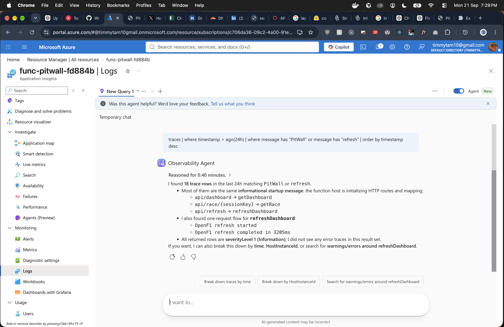
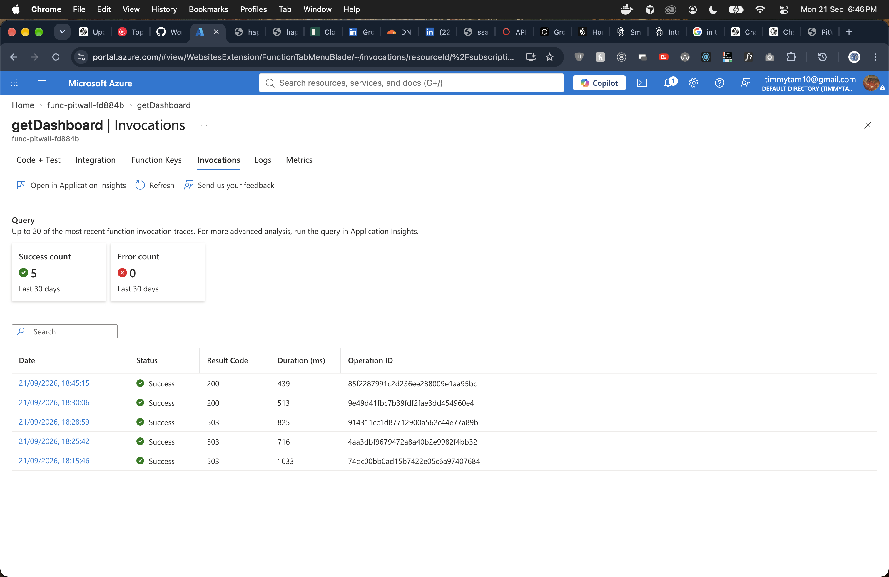

# Reliability

Visitor traffic for the core dashboard does not depend on OpenF1 being up at request time.

## Last-known-good dashboard

`refreshDashboard()` builds a complete snapshot in memory, then writes `dashboard.json`. A failed OpenF1 call throws before the write. The previous blob remains.

```text
refresh fails
     ↓
old cache remains
     ↓
GET /api/dashboard still 200
     ↓
Application Insights records the failure
```

The HTTP handler does not retry OpenF1 on a stale read. It returns the cached body and sets `stale: true` when `generatedAt` is older than `DASHBOARD_STALE_MS` (default 12 hours). The frontend shows that as a freshness warning, not a blank page.

Until the first successful refresh, `GET /api/dashboard` returns 503. That is the empty-cache case, not a failed refresh.

## Independent race caches

Race-detail blobs are per `sessionKey`. A miss that fails (404, 429, 502) does not touch `dashboard.json` or other race files. The Season So Far list stays usable.

There is no anonymous rebuild of a race blob. If OpenF1 later amends a result, the cached file stays until it is overwritten by a maintenance refresh. `generatedAt` on the race payload is the evidence of when it was built.

## Upstream behaviour the adapter actually implements

- requests are paced to stay inside OpenF1's free-tier 3 req/s budget
- HTTP 429 is retried twice
- network and non-2xx responses become `OpenF1Error`
- race-detail 429 is passed through to the client as 429; other build failures are 502

## Observability

Application Insights is attached to the Function App. Dashboard reads, race-detail cache hits/misses, and scheduled refreshes show up as traces. Failures are logged without overwriting the last-known-good snapshot.





## What this is not

This is not a live-timing product and it does not fail over to a second upstream. If OpenF1 is down during a scheduled refresh, the site keeps serving the previous dashboard and records the miss. That is the designed failure mode.
